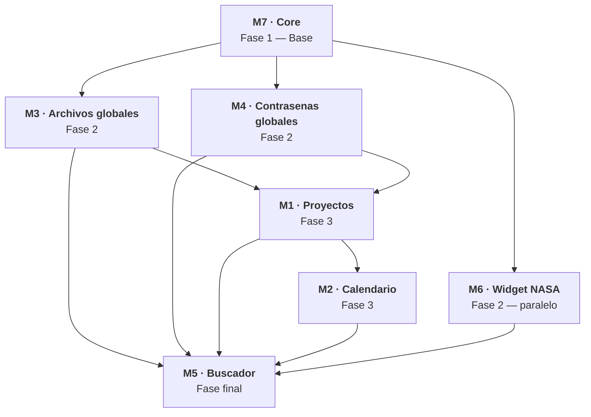

# DevHelper · Roadmap

> Hoja de ruta del proyecto. El indice de cada modulo vive en `docs/milestones/` y el detalle de cada tarea en `docs/tasks/`.

---

## Sobre DevHelper

Aplicacion web para centralizar el mantenimiento de proyectos de software: proyectos, calendario, archivos y contrasenas en un solo lugar, con un buscador transversal y un widget de inspiracion diaria.

---

## Modulos

| ID  | Modulo                                                          | Estado          |
| --- | --------------------------------------------------------------- | --------------- |
| M7  | [Core](./milestones/07-core.md)                                 | `[ ]` Pendiente |
| M3  | [Archivos globales](./milestones/03-archivos-globales.md)       | `[ ]` Pendiente |
| M4  | [Contrasenas globales](./milestones/04-contrasenas-globales.md) | `[ ]` Pendiente |
| M6  | [Widget NASA](./milestones/06-widget-nasa.md)                   | `[ ]` Pendiente |
| M1  | [Proyectos](./milestones/01-proyectos.md)                       | `[ ]` Pendiente |
| M2  | [Calendario](./milestones/02-calendario.md)                     | `[ ]` Pendiente |
| M5  | [Buscador](./milestones/05-buscador-global.md)                  | `[ ]` Pendiente |

---

## Organizacion

- Cada modulo se documenta en su propio fichero `docs/milestones/M#-<slug>.md`.
- Las tareas se listan dentro de cada modulo como items de checklist. El estado se deduce del checkbox:
  - `[ ]` Pendiente
  - `[x]` Hecho
- Al abrir una tarea, su contenido se mueve a `docs/tasks/M#-T#-<slug>.md` con el desglose completo (interfaces, UI, validaciones, tests, criterios de aceptacion) y en el hito queda solo el checkbox actualizado.

---

## Orden de desarrollo

### Secuencia

1. **M7 · Core** — base sobre la que se construye todo lo demas.
2. **M3 · Archivos globales** y **M4 · Contrasenas globales** — en paralelo tras Core.
3. **M6 · Widget NASA** — tras Core, independiente del resto.
4. **M1 · Proyectos** — requiere M3 y M4.
5. **M2 · Calendario** — tras M1.
6. **M5 · Buscador** — el ultimo, una vez estan listos los modulos que indexa.
